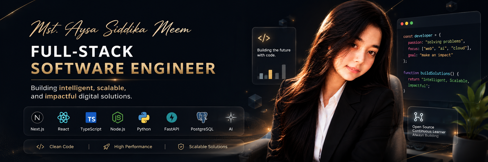

# 👋 Hello there, I'm Mst. Aysa Siddika Meem

Welcome to my GitHub profile! I'm **Mst. Aysa Siddika Meem**, a passionate **Computer Science and Engineering (CSE)** student at **Independent University, Bangladesh (IUB)**, with a minor in **Big Data and HCI**. I'm currently learning **web development** and aiming to be a **great software engineer soon**! 🚀  

---

## 👩‍💻 About Me

I enjoy solving real-world problems through technology — whether it's building a smart gardening platform, optimizing AI workflows, or creating accessible web tools.  
I'm also part of **FabSat's CanSat projects**, where I contribute as a **programmer, content writer, and video editor**.

When I'm not coding, you'll probably find me eating **ice cream** 🍦 and exploring new ideas in **AI, sustainability, or human-computer interaction**!

---

## 👀 Areas of Interest
- 🤖 Robotics, automation & embedded systems  
- 🧠 Machine learning, deep learning & computer vision  
- 🚀 Parallel processing & high-performance computing  
- 🌱 IoT, aquaponics & smart environmental systems  
- 🌐 Full-stack web development & UI/UX  

---

## 🌟 Notable Projects

### 🔹 **📰 ChronicleInk – FullStack News Platform**

- A full-featured news platform built with **React**, **Vite**, **Firebase**, **Node.js**, and **MongoDB**
- Supports **authentication**, **premium subscriptions**, **article management**, and an **admin dashboard**
- Includes **responsive design**, **light/dark mode**, and **Google Charts** for analytics
- 📍 **Live Site:** [chronicle-ink-full-stack-news-platf.vercel.app](https://chronicle-ink-full-stack-news-platf.vercel.app/)
- 💻 **GitHub Repo:** [MRaysa/ChronicleInk-FullStack-News-Platform](https://github.com/MRaysa/ChronicleInk-FullStack-News-Platform)

### 🔹 **📚 BookVerse – Library Management System**  
- Built a full-stack app to manage books using **React, Tailwind CSS, Express.js**, and **MongoDB (without Mongoose)**.  
- Features: **authentication**, **CRUD operations**, **protected routes**, and JWT-based access.

### 🔹 **🌤️ Real-Time Weather App**  
- Developed a responsive **React** web app using a live weather API.  
- Supports location-based search, dynamic UI, and forecast data display.

### 🔹 **🌿 Gardening Tips App**  
- Designed a full-stack solution to post, manage, and browse **gardening tips**.  
- Includes sections like **Seasonal Planting Guide** and **Plant Doctor** for diagnosis and planning.

### 🔹 **♻️ Smart Waste Management & Recycling Platform** *(Research)*  
- Developing an AI-powered IoT system for smart waste bin tracking, community recycling, and efficient resource use.  
- Currently authoring a research paper on the system design and implementation.

### 🔹 **স্বরসংকেত: Vision Transformer-Based Bengali Sign Language Interpreter**  *(Research)*  
- Built a **web app** that converts **Bengali Sign Language** to text using deep learning and **Vision Transformers**.  
- Future plans: **HCI**, multilingual support & **text-to-speech** integration.

### 🔹 **Comprehensive Heart Health Monitoring System (CHHMS)**  
- Developed a real-time health monitoring system using **IoT sensors** to track ECG, heart rate, and BP.

### 🔹 **Parallel Processing for Brain Tumor Detection**  
- Implemented **multithreading** to accelerate CNN-based **MRI tumor analysis**, improving preprocessing time & accuracy.

### 🔹 **Aquaponics Monitoring System**  
- Built a sensor-integrated IoT setup for managing **water quality**, **nutrients**, and environmental data in aquaponics farms.

---

## 🌱 Currently Exploring
- 🌐 Full-stack development with **React**, **Node.js**, and **MongoDB**  
- ⚡ Parallel programming with **OpenMP/Threads** for model acceleration  
- 🤖 Advanced machine learning models & **Vision Transformers**  
- 📡 Real-time systems with **IoT, sensors, and automation**

---

## 💻 My Tech Stack:
### **Languages**:

### **Web Development**:

### **AI & Tools**:

---

## 🤝 I'm Open to Collaborating On
- 🔍 Research in **AI, parallel computing, or sustainable technology**  
- 🌐 Web & software development projects with real-world impact  
- 🤖 Open-source projects in **ML, robotics, or smart systems**

---

<!-- 🌟 GitHub Stats Section - Optimized & Fixed -->

## 📊  GitHub Analytics
  
<!-- Dynamic Stats Grid with Cache Busting -->

  <a href="https://github.com/MRaysa">
    <!-- Main Stats with forced cache refresh -->
    
    <!-- Top Languages with proper exclusion -->
    
  </a>

<!-- Streak Stats with Dual Source Fallback -->

  

<!-- Activity Graph with Fallback -->

  

<!-- Trophy Case with Error Handling -->

 
  

<!-- Profile Views Counter with Fallback -->

   

---

## 📫 How to reach me:

---

## 😄 Pronouns:
She/Her  

---

## ⚡ Fun fact:
I love **coding & ice cream** 🍦💻! Whether it's **optimizing AI performance** or **building creative solutions**, I enjoy merging **technology with innovation**! 🚀
